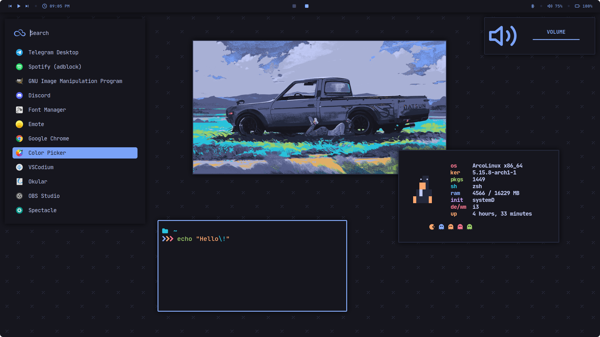
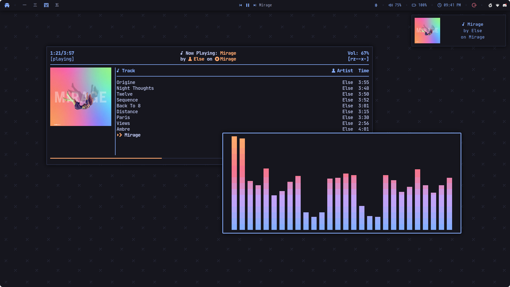
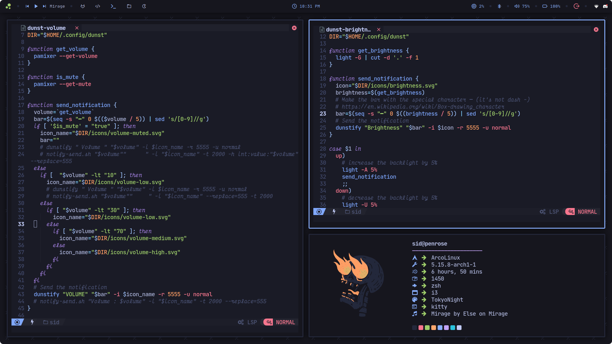
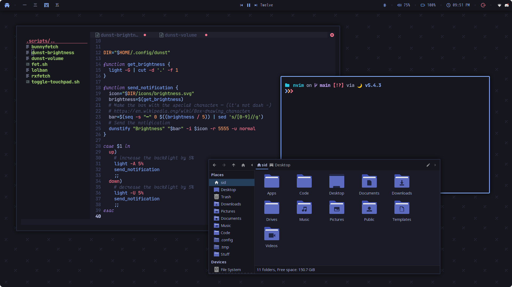
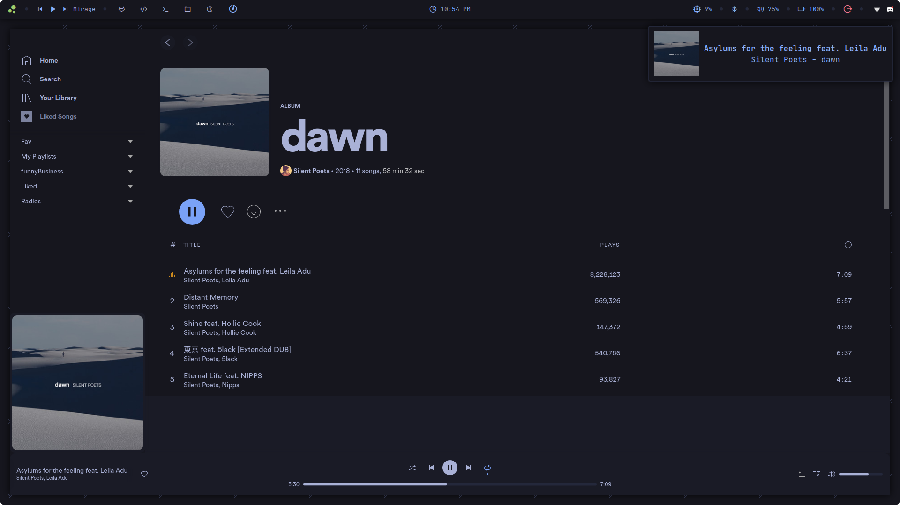
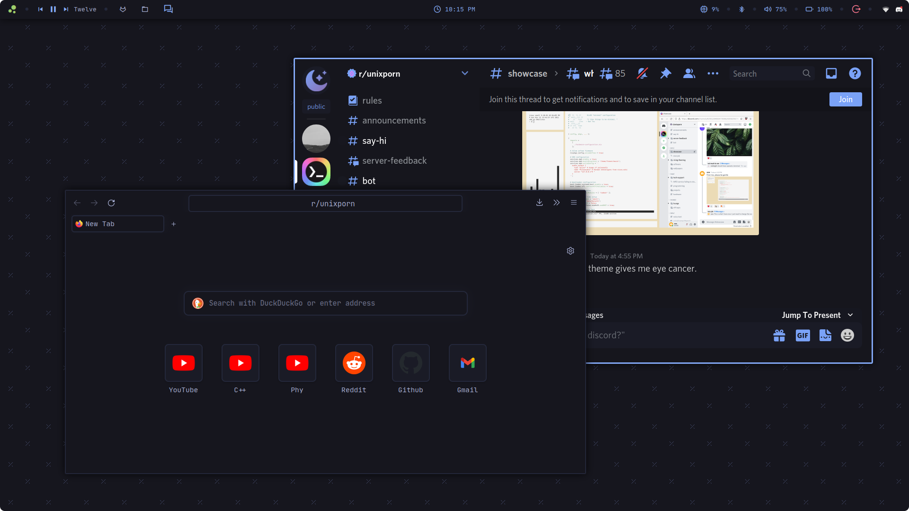
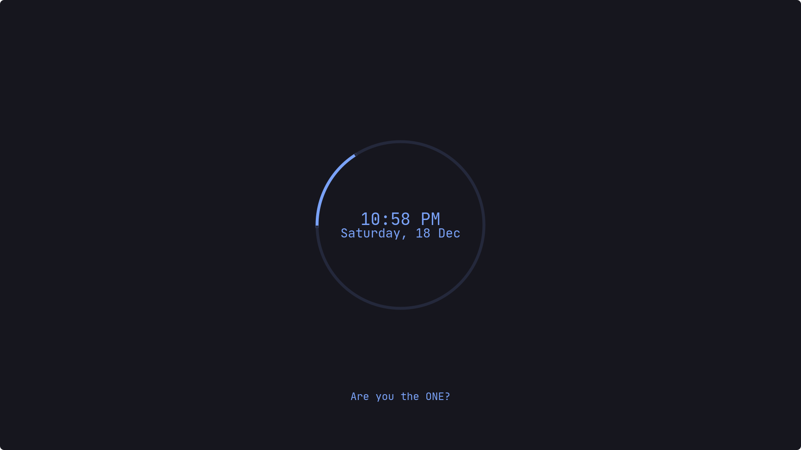
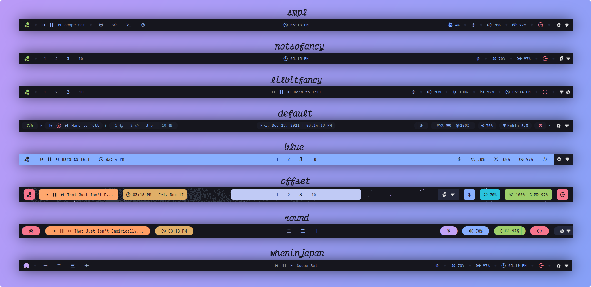

<h1 align=center>Tokyo Night Dotfiles</h1>

<p align=center>
  
</p>

<p align=center> Hi! This repository contains the configuration files a.k.a. the dotfiles of my Arch-Linux i3wm setup based on the Tokyo Night color-scheme</p>

<p align=center>Grab anything you want! Just be careful with my i3 config, don't blindly copy the whole thing, somethings may not work on your system. Just cherry-pick what you want to keep your system clean. You can install the whole thing but I do not recommend it. Go through the configs before doing anything :D</p>

<p align=center>
Please make sure you go through this README :)<br>
If you get stuck somewhere you can always message me on Discord at <code>rototrash#9000</code><br>
Have a good time! 😄
</p>

<p align=center>
<strong>PS:</strong> 
If you are here for my old dotfiles based on the Ayu-Dark colors, check out the <a href="https://github.com/rototrash/dotfiles/tree/ayu-dots">Ayu-dots Branch</a>
</p>

## Previews
<p align=center>
Rofi + Kitty

</p>
<p align=center>
NCMCCPP + Cava

</p>

<p align=center>
Neovim + neofetch

</p>

<details>
<summary><strong>More Previews!</strong></summary>
<p align=center>
Thunar + Neovim

</p>

<p align=center>
Spotify

</p>

<p align=center>
Firefox + Discord

</p>

<p align=center>
i3-lock

</p>

<p align=center>
SDDM

</p>

</details>

<details>
<summary><strong>Polybar Styles</strong></summary>

NOTE: Modify the i3 config file to change the polybar style, I will probably automate it using a script sometime later :|
</details>

## Alrighty get ready to install some bloat

<details>
<summary><strong>Fonts</strong></summary>
<ul>
    <li> nerd-fonts-jetbrains-mono </li> 
    <li> nerd-fonts-victor-mono </li>
    <li> nerd-fonts-mplus </li>
    <li> ttf-jetbrains-mono </li>
    <li> ttf-font-awesome </li>
    <li> ttf-material-design-icons </li>
    <li> ttf-remixicon </li>
    <li> ttf-icomoon-feather </li>  
</ul>
</details>

```shell
$ yay -S nerd-fonts-jetbrains-mono nerd-fonts-victor-mono nerd-fonts-mplus ttf-jetbrains-mono ttf-font-awesome ttf-material-design-icons ttf-remixicon ttf-icomoon-feather
```
<details>
<summary><strong>Packages and Apps</strong></summary>
Hopefully these are all, tell me in case you find something that isn't listed here :)
<ul>
    <li> i3-gaps </li>
    <li> feh </li>
    <li> light </li>
    <li> dunst </li>
    <li> polybar </li>
    <li> starship-git </li>
    <li> i3lock-color </li>
    <li> ueberzug, w3m </li>  
    <li> picom-jonaburg-git </li>
    <li> mpd, ncmpcpp, cava </li>
    <li> kitty or alacritty or wezterm </li> 
    <li> blueberry, bluez, bluez-utils</li>
    <li> rofi, rofi-power-menu, rofi-emoji </li>
    <li> pavucontrol, pulseaudio-control </li>
</ul>
</details>

```shell
$ yay -S i3-gaps kitty polybar rofi rofi-power-menu rofi-emoji dunst light picom-jonaburg-git i3lock-color feh bluez bluez-utils blueberry pulseaudio-control pavucontrol mpd ncmpcpp cava ueberzug w3m starship-git
```

## Some Important Stuff: 
- **GTK THEME:**
Grab the Tokyo Night GTK Theme from here: [`github.com/koiosdev/Tokyo-Night-Linux`](https://github.com/koiosdev/Tokyo-Night-Linux). Follow the instruction over there to install and enable it. <br> **P.S:** The aforementioned repo also has tokyo-night themes for Discord and Spotify.

- **BLUETOOTH:** Make sure you have the bluetooth utilites installed (`bluez, bluez-utils, blueberry`). Then enable the bluetooth service `sudo systemctl enable --now bluetooth`

- **WALLPAPERS:**
If you want some wallpapers that go along this theme this repo [`github.com/rototrash/wallpapers`](https://github.com/rototrash/wallpapers)

- <details>
    <summary><strong>NCMPCPP:</strong> Displaying the Album Cover</summary>
    <ul>
    <li> I use some scripts for displaying the current track's cover art in ncmpcpp cli and also send dunst notifications when the track changes which I got from <a href="https://github.com/tam-carre/ncmpcpp-ueberzug"><code>github.com/tam-carre/ncmpcpp-ueberzug</code></a>. Follow the instructions given over there to get it running.
    </li>
    <br>
    <li> Also there are two ncmcpp configs inside the ncmpcpp folder, the   <kbd>config</kbd> file is the one that displays cover art and the <kbd>config.normal</kbd> file which is without the cover art.
    </li>
    <br>
    <li> If you don't want the cover art, simply rename the current <kbd>config</kbd> to <kbd>config.art</kbd> and the <kbd>config.normal</kbd> to <kbd>config</kbd>. I know this sounds confusing lol.
    </li>
    </ul>
</details>

-   **NVIM:** Nvim config files from [`NvChad`](https://github.com/NvChad/NvChad)

- **SDDM:** Get the SDDM theme from here [`tokyo-night-sddm`](https://github.com/rototrash/tokyo-night-sddm)

- **FIREFOX:** FirefoxCSS from [`tokyo-night-fox`](https://github.com/rototrash/tokyo-night-fox)
## Keybinds

I use <kbd>super</kbd> AKA Windows key as my main modifier.
<details>
<summary> Basic Keybinds</summary>

| Keybind | Action |
| --- | --- |
| <kbd>super + enter</kbd> | Spawn Terminal (kitty) |
| <kbd>super + shift + enter</kbd> | Spawn Thunar |
| <kbd>super + shift + f</kbd> | Launch rofi launcher |
| <kbd>super + control + l</kbd> | Launch rofi-power-menu |
| <kbd>super + q</kbd> | Close client |
| <kbd>super + shift + space</kbd> | Float active client |
| <kbd>super + space</kbd> | Switch Focus between Floating and Tiled clients |
| <kbd>super + [1-0]</kbd> |  Change workspace |
| <kbd>super + shift + [1-0]</kbd> | Move focused client to workspace |
| <kbd>control + Alt + [arrow keys]</kbd> | Move between active workspaces |
| <kbd>super + e</kbd> | Tiling layout |
| <kbd>super + z</kbd> | Tabbed layout |
| <kbd>super + s</kbd> | Stacked layout |
| <kbd>super + [arrow keys]</kbd> | Change focus by direction 
| <kbd>super + [hjkl]</kbd> | ^ |
| <kbd>super + shift + [arrow keys]</kbd> | Move client by direction. (Floating and Tiled) |
| <kbd>super + shift + [hjkl]</kbd> | ^ |
| <kbd>super + control + alt +[arrow keys]</kbd> | Resize active client |
| <kbd>super + f</kbd> | Toggle fullscreen |
| <kbd>super + shift + r</kbd> | Reload i3 |
| <kbd>super + v</kbd> | Split Client Vertically |
| <kbd>super + b</kbd> | Split Client Horizontally |
| <kbd>super + shift + b</kbd> | hide/unhide polybar |

Go through the i3 config file for more.

</details>


## Why?
The primary purpose of this repository is to help myself setting up and maintaining my workspaces in case something goes wrong or I want to replicate my setup on other systems :)

## Credits
- [@erikdubois](https://github.com/erikdubois) and Arcolinux Team for this amazing [Distro](https://arcolinux.com/)
- [@enkia](https://github.com/enkia) for the Tokyo Night colors
- [@dempfi](https://github.com/dempfi) for the Ayu colors
- [@koisodev](https://github.com/koiosdev/Tokyo-Night-Linux) for the Tokyo Night GTK and spotify themes 
- [@tam-carre](https://github.com/tam-carre) for [ncmpcpp-ueberzug](https://github.com/tam-carre/ncmpcpp-ueberzug)
- [@adi1090x](https://github.com/adi1090x) for some of his scripts that I yoinked
- The [r/unixporn](https://www.reddit.com/r/unixporn/) and the Linux 
community

## License
[**MIT**](https://github.com/rototrash/dotfiles/blob/main/LICENSE)

All attempts have been made to identify third party content within the repository, with sources and attribution given where necessary. Please contact me if any issues are discovered.


