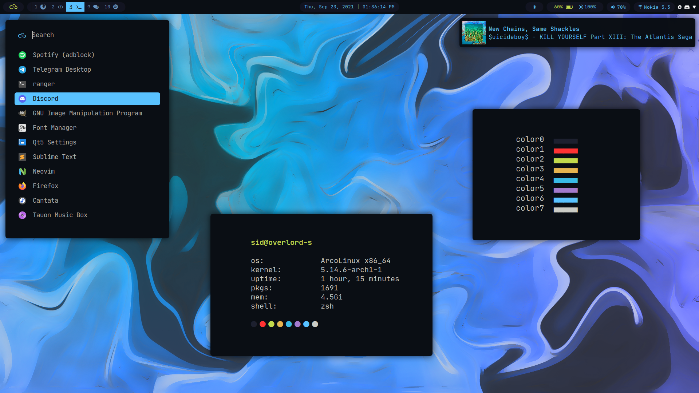

# dotfiles

Grab whatever you want I don't care. Just be careful with my i3 config, don't blindly copy the whole thing, somethings may not work on your system or things might break idk ¯\\_\_(ツ)_\_/¯. Pick up the parts you like from it.

# Previews
- [TOKYO NIGHT](./theme-tokyo-night) (This is what I'm using for a while now)

- [AYU DARK](./theme-ayu-dark) (This I don't use anymore)

Look inside the respective theme folder for more previews and info

# Alright stuff that you'll need:
- **Fonts:**
    - nerd-fonts-jetbrains-mono 
    - ttf-jetbrains-mono  
    - ttf-font-awesome  
    - ttf-material-design-icons

- **Packages and Apps:**
    - kitty
    - alacritty
    - polybar
    - rofi
    - rofi-power-menu
    - dunst
    - light
    - picom-ibhagawan
    - i3lock-color
    - feh
    - blueberry
    - pavucontrol
    - mpd
    - ncmpcpp
    - cava

# Some Info about my system

| Program | Name |
| :---: | :---: |
| Distro | [ArcoLinuxB](https://arcolinux.com/) |
| WM| [i3-gaps](https://i3wm.org/) |
| Notifs | [Dunst](https://dunst-project.org/) |
| Shell | zsh |
| Fetch | [neofetch](https://github.com/dylanaraps/neofetch) |
| Icons | [Papirus](https://github.com/PapirusDevelopmentTeam/papirus-icon-theme) |
| Editor | [VS-Codium](https://vscodium.com/) |
| Lockscreen | [i3lock-color](https://github.com/Raymo111/i3lock-color) |
| Music Player | [ncmpcpp](https://github.com/ncmpcpp/ncmpcpp) |
| Web Browser | [Firefox](https://www.mozilla.org/en-US/firefox/new/) |
| Login Manager | [sddm](https://github.com/sddm/sddm) |

# Credits
- [@adi1090x](https://github.com/adi1090x) for some of his scripts that I yoinked
- [@erikdubois](https://github.com/erikdubois) and Arcolinux Team for this amazing [Distro](https://arcolinux.com/)
- The [r/unixporn](https://www.reddit.com/r/unixporn/) and the Linux community
- [@enkia](https://github.com/enkia) for the Tokyo Night colors
- [@dempfi](https://github.com/dempfi) for the Ayu colors
- [@koisodev](https://github.com/koiosdev/Tokyo-Night-Linux) for the Tokyo Night GTK and spotify themes 

# License
[**MIT**](https://github.com/rototrash/dotfiles/blob/main/LICENSE)

All attempts have been made to identify third party content within the repository, with sources and attribution given where necessary. Please contact me if any issues are discovered.

