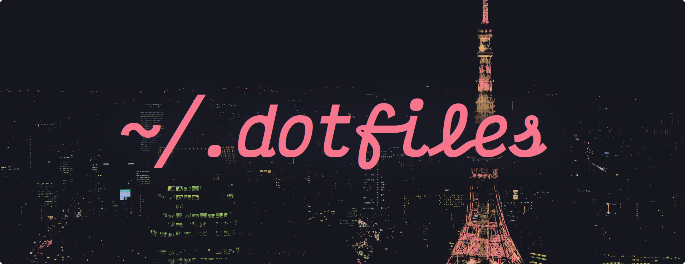
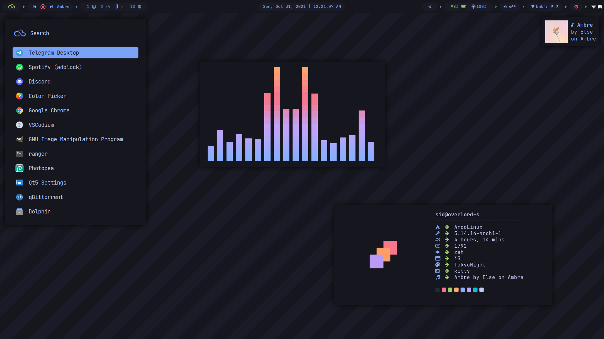
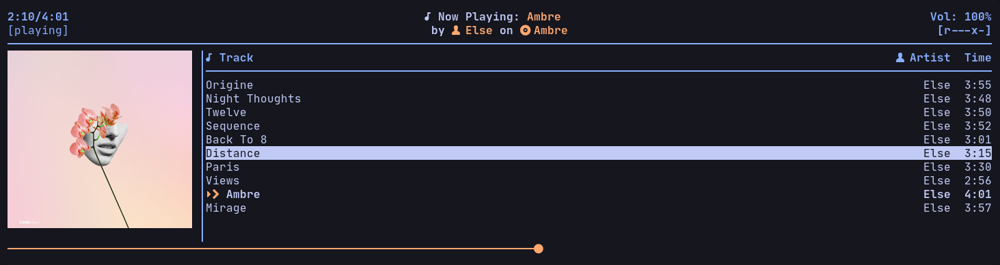

# dotfiles

Grab whatever you want I don't care. Just be careful with my i3 config, don't blindly copy the whole thing, somethings may not work on your system or things might break idk ¯\\_\_(ツ)_\_/¯. Pick up the parts you like from it.

The `theme-tokyo-night` directory contains all the config files.

**Note:** If you are here for my old dotfiles based on the Ayu-Dark colors, check out the [ayu-dots branch](https://github.com/rototrash/dotfiles/tree/ayu-dots)

# Previews
- [Tokyo Night](./theme-tokyo-night) (This is what I use!)




# Alright stuff that you'll need:
- **Fonts:** Install these
    - nerd-fonts-jetbrains-mono 
    - ttf-jetbrains-mono  
    - ttf-font-awesome  
    - ttf-material-design-icons
```
$ yay -S nerd-fonts-jetbrains-mono ttf-jetbrains-mono ttf-font-awesome ttf-material-design-icons
```

- **Packages and Apps:** Install them.
    - kitty
    - polybar
    - rofi
    - rofi-power-menu
    - dunst
    - light
    - picom-ibhagawan
    - i3lock-color
    - feh
    - blueberry
    - bluez
    - bluez-utils
    - pavucontrol
    - mpd
    - ncmpcpp
    - cava
    - ueberzug
    - w3m
    - pulseaudio-control
```
$ yay -S kitty alacritty polybar rofi rofi-power-menu dunst light picom-ibhagawan i3lock-color feh bluez bluez-utils blueberry pulseaudio-control pavucontrol mpd ncmpcpp cava ueberzug w3m
```

# Notes: 
- [**GTK Theme for Tokyo Night**](https://github.com/koiosdev/Tokyo-Night-Linux): Follow the instruction from that repository to install the GTK theme.

- **Bluetooth:** Make sure you have the bluetooth utilites installed (`bluez, bluez-utils, blueberry`). Then enable the bluetooth service `sudo systemctl enable --now bluetooth`

- **NCMPCPP:**
    
    + **Preview**

    

    + I use some scripts for displaying the current track's cover art in ncmpcpp cli and also send dunst notifications when the track changes which I got from [here](https://github.com/tam-carre/ncmpcpp-ueberzug). You need to have ueberzug installed: `pip3 install ueberzug`

    + Make the scripts in the `~/.config/ncmpcpp/ncmpcpp-ueberzug` directory executable by running `chmod +x ncmpcpp-ueberzug ncmpcpp_cover_art.sh`

    + Simply run ncmpcpp-ueberzug to open ncmpcpp with album art enabled. `~/.config/ncmpcpp/ncmpcpp-ueberzug/ncmpcpp-ueberzug`

    + You may move or symlink it somewhere in your $PATH such that using its full path is unneeded. For example: 
    + ```
      $ ln -s ~/.ncmpcpp/ncmpcpp-ueberzug/ncmpcpp-ueberzug ~/.local/bin/
      $ ncmpcpp-ueberzug
        ```
    + Also there are two ncmcpp configs inside the ncmpcpp folder, the `config` file is the one that displays cover art and the `config.normal` file which is without the cover art. Simply rename it (`ncmpcpp.normal`) to `config` if you want ncmpcpp without the cover art, and the other one to something else like `ncmpcpp.art`

# Some Info about my system

| Program | Name |
| :---: | :---: |
| Distro | [ArcoLinuxB](https://arcolinux.com/) |
| WM| [i3-gaps](https://i3wm.org/) |
| Notifs | [Dunst](https://dunst-project.org/) |
| Shell | zsh |
| Fetch | [neofetch](https://github.com/dylanaraps/neofetch) |
| Icons | [Papirus](https://github.com/PapirusDevelopmentTeam/papirus-icon-theme) |
| Editor | [VS-Codium](https://vscodium.com/) |
| Lockscreen | [i3lock-color](https://github.com/Raymo111/i3lock-color) |
| Music Player | [ncmpcpp](https://github.com/ncmpcpp/ncmpcpp) |
| Web Browser | [Firefox](https://www.mozilla.org/en-US/firefox/new/) |
| Login Manager | [sddm](https://github.com/sddm/sddm) |


# Credits
- [@erikdubois](https://github.com/erikdubois) and Arcolinux Team for this amazing [Distro](https://arcolinux.com/)
- [@enkia](https://github.com/enkia) for the Tokyo Night colors
- [@dempfi](https://github.com/dempfi) for the Ayu colors
- [@koisodev](https://github.com/koiosdev/Tokyo-Night-Linux) for the Tokyo Night GTK and spotify themes 
- [@tam-carre](https://github.com/tam-carre) for [ncmpcpp-ueberzug](https://github.com/tam-carre/ncmpcpp-ueberzug)
- [@adi1090x](https://github.com/adi1090x) for some of his scripts that I yoinked
- The [r/unixporn](https://www.reddit.com/r/unixporn/) and the Linux 
community

# License
[**MIT**](https://github.com/rototrash/dotfiles/blob/main/LICENSE)

All attempts have been made to identify third party content within the repository, with sources and attribution given where necessary. Please contact me if any issues are discovered.
